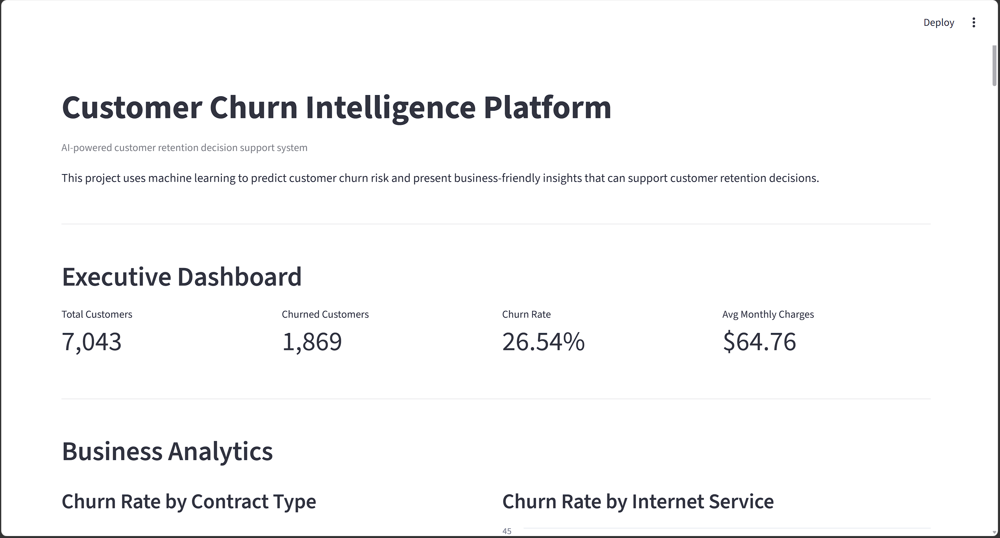
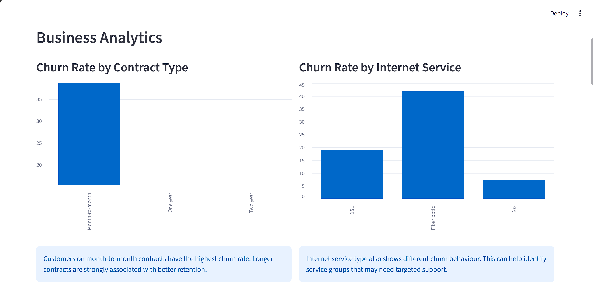
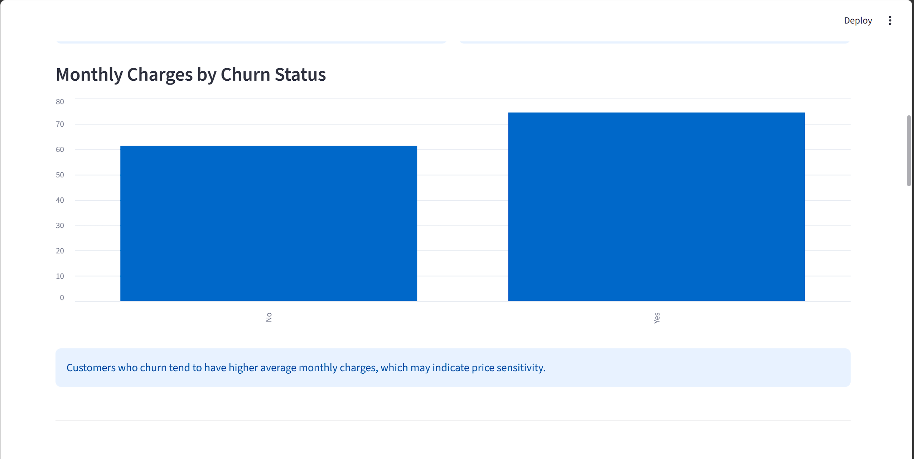
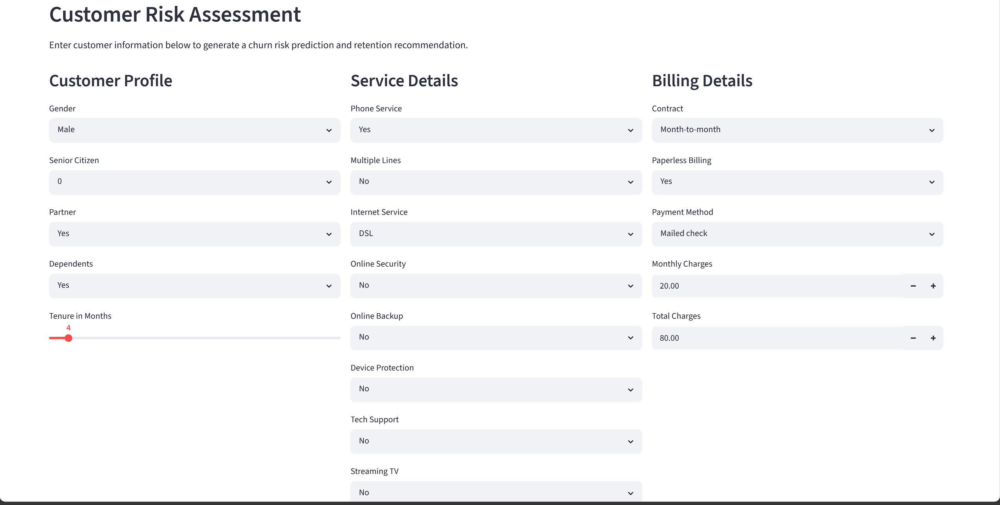
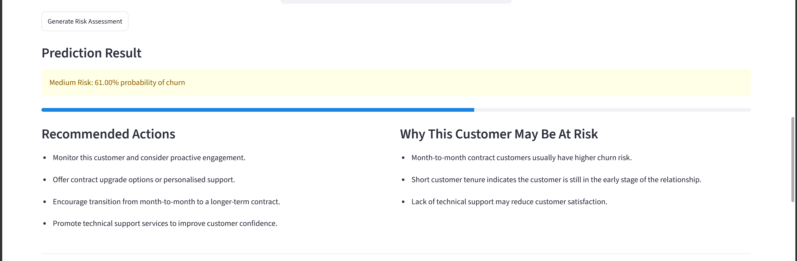
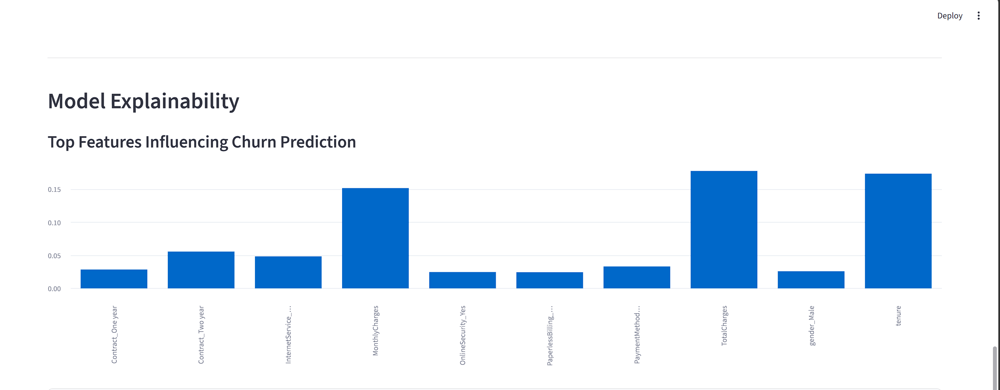
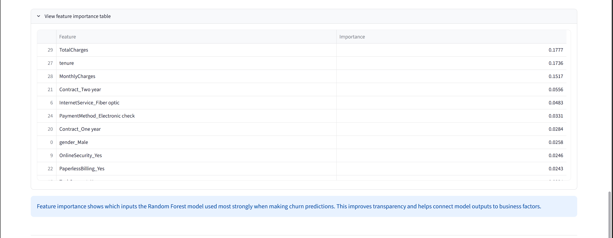
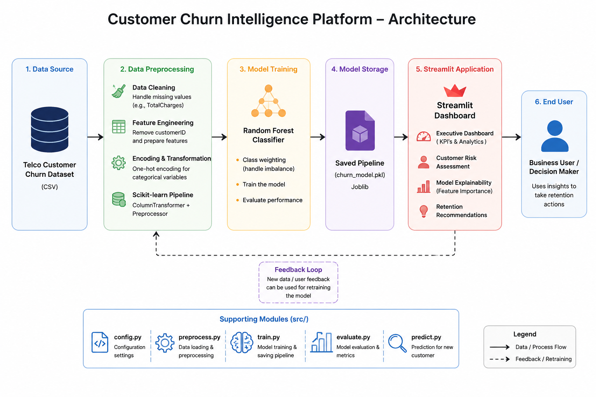

# Customer Churn Intelligence Platform

An end-to-end machine learning application that predicts telecom customer churn using a **Scikit-learn Pipeline**, **Random Forest Classifier**, and an interactive **Streamlit dashboard**. The platform combines business analytics, explainable AI, and customer retention recommendations to support business decision-making.

---

## Application Preview

### Executive Dashboard




### Customer Risk Assessment



### Model Explainability




---

## Business Problem

Customer churn is one of the biggest challenges faced by subscription-based businesses. Retaining existing customers is generally more cost-effective than acquiring new ones. This project predicts customers who are likely to leave so that businesses can proactively improve customer retention and reduce revenue loss.

---

## Solution

This application implements a complete machine learning workflow that:

- Cleans and preprocesses telecom customer data
- Trains a Random Forest classification model
- Predicts customer churn probability
- Generates business-oriented retention recommendations
- Presents interactive analytics through a Streamlit dashboard

---

## Features

- Executive business dashboard
- Customer churn prediction
- Churn probability estimation
- Business analytics and visualisations
- Explainable AI using feature importance
- Customer retention recommendations
- Interactive Streamlit web application

---

## Technologies Used

| Category | Technologies |
|-----------|--------------|
| Programming Language | Python |
| Data Analysis | Pandas, NumPy |
| Machine Learning | Scikit-learn |
| Model | Random Forest Classifier |
| Deployment | Streamlit |
| Model Storage | Joblib |

---

## System Architecture



```text
Customer Dataset
        │
        ▼
Data Cleaning
        │
        ▼
Scikit-learn Preprocessing Pipeline
        │
        ▼
Random Forest Classifier
        │
        ▼
Saved Model (.pkl)
        │
        ▼
Streamlit Dashboard
        │
        ▼
Business User
```

---

## Machine Learning Workflow

1. Loaded the telecom customer churn dataset.
2. Cleaned the data and handled missing values in `TotalCharges`.
3. Removed the `customerID` column because it does not contribute to prediction.
4. Split the dataset into training and testing sets using stratified sampling.
5. Built a Scikit-learn preprocessing pipeline.
6. Applied one-hot encoding to categorical features.
7. Trained a Random Forest classifier with balanced class weights.
8. Evaluated the model using multiple classification metrics.
9. Saved the trained pipeline using Joblib.
10. Built an interactive Streamlit dashboard for prediction and business insights.

---

## Model Performance

| Metric | Score |
|---------|------:|
| Accuracy | **76.9%** |
| Precision | **55.9%** |
| Recall | **62.3%** |
| F1 Score | **58.9%** |

The project prioritises **Recall** because identifying customers who are likely to churn is more valuable than simply achieving higher overall accuracy. Missing a customer who is likely to leave can result in lost revenue, whereas contacting a customer who may not churn generally has a much lower business cost.

---

## Project Structure

```text
customer-churn-intelligence/
│
├── data/
│   └── telco_churn.csv
│
├── models/
│   └── churn_model.pkl
│
├── src/
│   ├── config.py
│   ├── train.py
│   ├── evaluate.py
│   ├── predict.py
│   └── preprocess.py
│
├── app.py
├── requirements.txt
├── README.md
└── .gitignore
```

---

## Installation

### Clone the repository

```bash
git clone <repository-url>
cd customer-churn-intelligence
```

### Install the required packages

```bash
pip install -r requirements.txt
```

### Train the model

```bash
python -m src.train
```

### Evaluate the model

```bash
python -m src.evaluate
```

### Launch the application

```bash
streamlit run app.py
```

---

## Key Business Insights

- Customers on **month-to-month contracts** have the highest churn rate.
- Customers with **shorter tenure** are more likely to leave.
- **Higher monthly charges** are associated with increased churn behaviour.
- **Payment method** and **technical support availability** also influence customer retention.

---

## Model Explainability

The application uses **Random Forest feature importance** to identify the variables that contribute most to churn prediction. This improves transparency by helping business users understand which customer attributes have the greatest impact on model predictions.

---

## Future Improvements

- Compare Random Forest with XGBoost, CatBoost, and Logistic Regression.
- Integrate SHAP values for individual prediction explanations.
- Support batch prediction through CSV file uploads.
- Deploy the application using Streamlit Community Cloud.
- Add automated model monitoring and retraining.

---

## Author

**Anoj Roshan M**

Master of Information Technology (Professional)

Deakin University

---

## License

This project is provided for educational and portfolio purposes.